# StayNGo — DevOps Project Report

> A full-stack hotel booking application containerized, orchestrated, and monitored using industry-standard DevOps tools.

---

## Table of Contents
1. [Project Overview](#project-overview)
2. [Tech Stack](#tech-stack)
3. [Part 1 — Dockerization](#part-1--dockerization)
4. [Part 2 — CI/CD with Jenkins](#part-2--cicd-with-jenkins)
5. [Part 3 — Code Quality with SonarQube](#part-3--code-quality-with-sonarqube)
6. [Part 4 — Kubernetes Deployment](#part-4--kubernetes-deployment)
7. [Part 5 — Monitoring with Prometheus & Grafana](#part-5--monitoring-with-prometheus--grafana)
8. [Screenshots Reference](#screenshots-reference)
9. [Architecture Diagram](#architecture-diagram)

---

## Project Overview

**StayNGo** is a hotel booking web application with a Next.js frontend and a Node.js/Supabase backend. The project demonstrates a complete DevOps pipeline covering containerization, CI/CD, static code analysis, Kubernetes orchestration, and real-time monitoring.

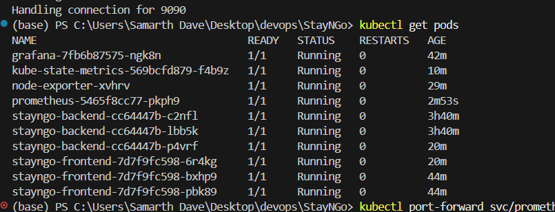

---

## Tech Stack

| Layer | Technology |
|---|---|
| Frontend | Next.js |
| Backend | Node.js + Supabase |
| Containerization | Docker + Docker Compose |
| CI/CD | Jenkins |
| Code Quality | SonarQube |
| Orchestration | Kubernetes (Docker Desktop) |
| Monitoring | Prometheus + Grafana + Node Exporter |
| Metrics Collection | kube-state-metrics, cAdvisor |

---

## Part 1 — Dockerization

### What We Did
- Created `Dockerfile` for the frontend (Next.js) and backend (Node.js)
- Created `docker-compose.yml` to run both services together locally
- Used environment variables for Supabase credentials
- Tested both services running in containers communicating over a Docker network

### Key Files
- `Dockerfile` (frontend & backend)
- `docker-compose.yml`

---

## Part 2 — CI/CD with Jenkins

### What We Did
- Set up Jenkins running locally on port `8080`
- Created a `Jenkinsfile` with a multi-stage pipeline:
  - **Clone** — pulls latest code from GitHub
  - **Build** — builds Docker images for frontend and backend
  - **Test** — runs automated tests
  - **SonarQube Analysis** — static code analysis stage
  - **Deploy** — deploys updated containers
- Jenkins pipeline log saved at `assets/jenkins_pipeline#15.txt`

### Key Files
- `Jenkinsfile`
- `assets/jenkins_pipeline#15.txt` — full pipeline console output

### Screenshot
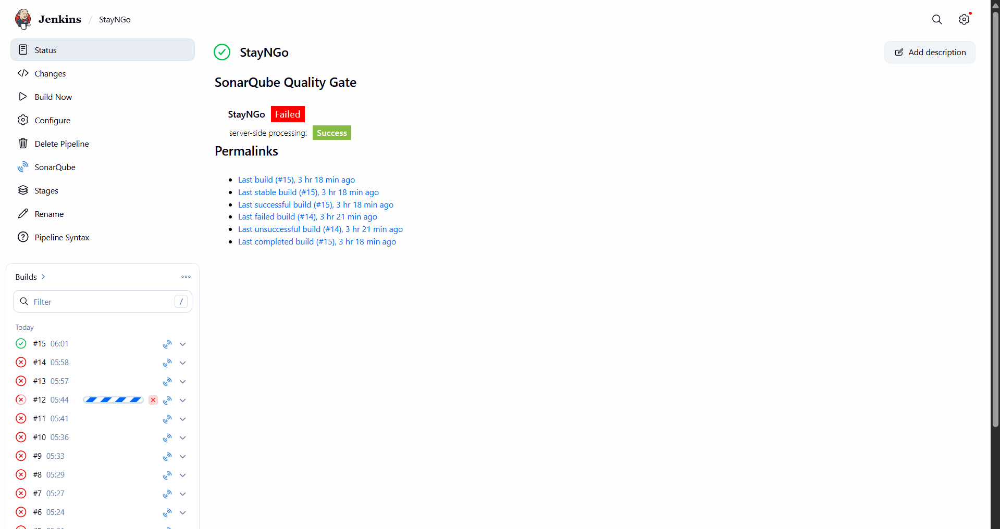

---

## Part 3 — Code Quality with SonarQube

### What We Did
- Integrated SonarQube into the Jenkins pipeline as a dedicated stage
- SonarQube scans the codebase for bugs, code smells, vulnerabilities, and coverage
- Configured `sonar-project.properties` for both frontend and backend
- Results visible at `http://localhost:9000`

### Key Files
- `sonar-project.properties`
- `Jenkinsfile` (SonarQube stage)

---

## Part 4 — Kubernetes Deployment

### What We Did
- Migrated from Docker Compose to Kubernetes (K8s) on Docker Desktop
- Created Kubernetes manifest files inside the `k8s/` folder:
  - `frontend-deployment.yaml` — Next.js frontend pods
  - `backend-deployment.yaml` — Node.js backend pods
  - `grafana.yaml` — Grafana monitoring UI
  - `promethus.yaml` — Prometheus metrics server + ConfigMap
  - `node-exporter.yaml` — DaemonSet for hardware-level metrics
  - `kube-state-metrics.yaml` — Kubernetes object state metrics
  - `prometheus-rbac.yaml` — RBAC ClusterRole for Prometheus API access
- Frontend exposed on `NodePort 32000`, backend on `NodePort 32001`
- Scaled both frontend and backend to **3 replicas** for high availability

### Key Commands
```bash
kubectl apply -f k8s/
kubectl get pods
kubectl get deployments
kubectl get nodes
kubectl scale deployment stayngo-frontend --replicas=3
kubectl scale deployment stayngo-backend --replicas=3
```

### Kubernetes Node
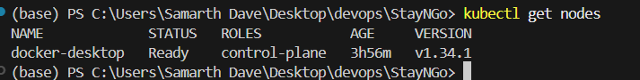

### All Pods Running
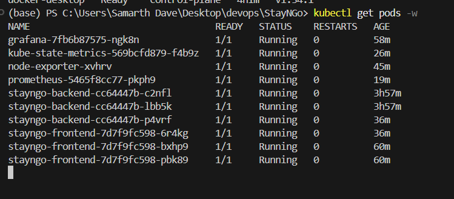

### All Deployments
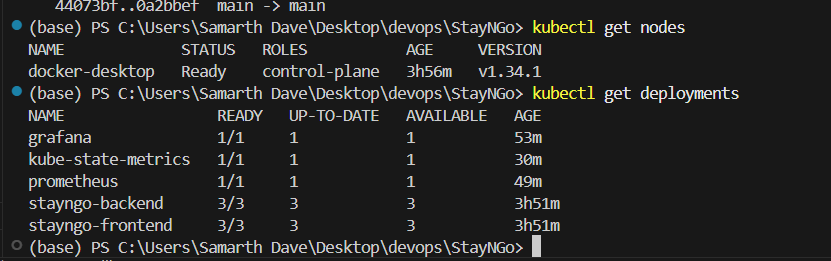

### Full Kubernetes Resources
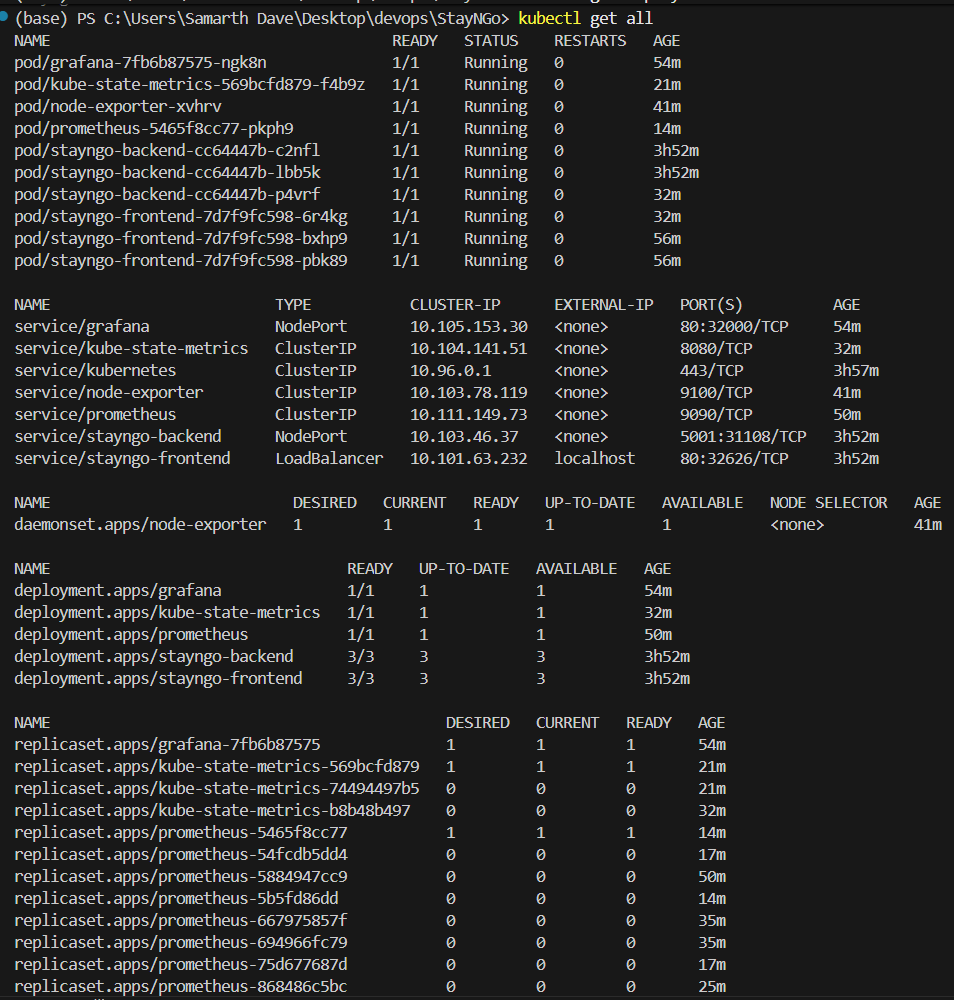
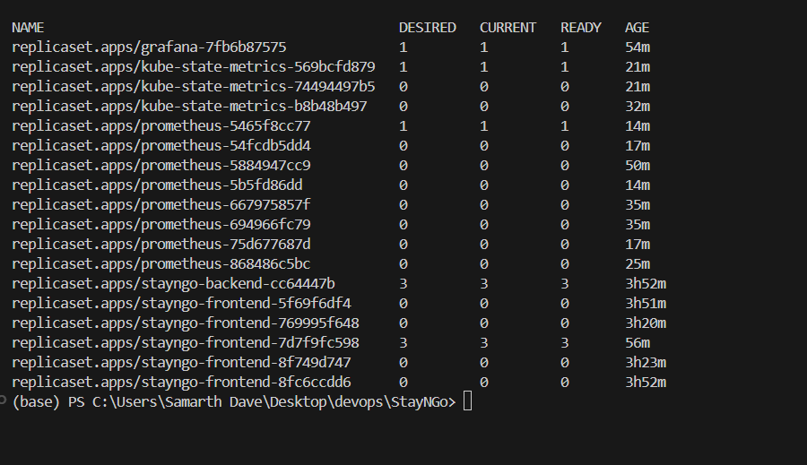

### Actual Deployment in Action
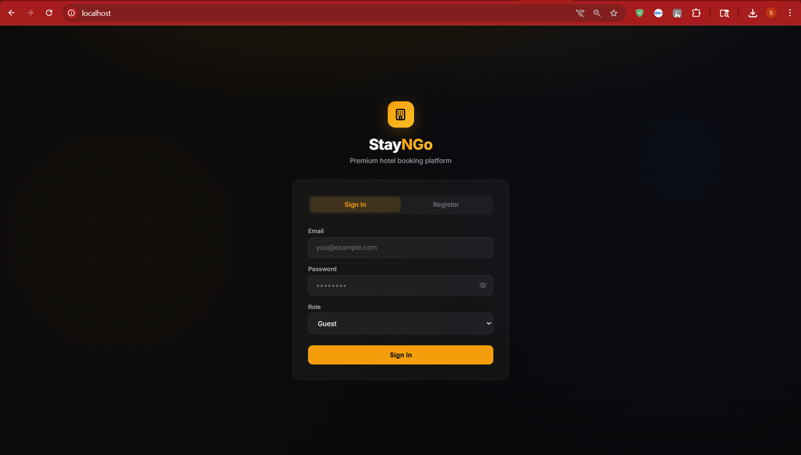

---

## Part 5 — Monitoring with Prometheus & Grafana

### What We Did

#### Prometheus Setup
- Deployed Prometheus as a Kubernetes Deployment with a ConfigMap-based config
- Configured 3 scrape jobs in `prometheus.yml`:
  1. **`node-exporter`** — scrapes hardware/OS metrics on port `9100`
  2. **`kube-state-metrics`** — scrapes Kubernetes object state on port `8080`
  3. **`kubernetes-cadvisor`** — scrapes per-container CPU/memory from the K8s API
- Added `ClusterRole` + `ServiceAccount` RBAC so Prometheus can call the K8s API

#### Node Exporter Setup
- Deployed as a **DaemonSet** — automatically runs one pod per cluster node
- Exposes hardware metrics: CPU, memory, disk I/O, network throughput
- Scales automatically: in a multi-node cluster, each node gets its own exporter

#### kube-state-metrics Setup
- Deployed with full RBAC permissions (ClusterRole + ClusterRoleBinding)
- Exposes pod status, deployment replica counts, container states

#### Grafana Setup
- Deployed on `NodePort 32000`, accessible at `http://localhost:32000`
- Prometheus added as data source: `http://prometheus:9090`
- Imported **Dashboard ID 1860** — Node Exporter Full

### Prometheus Targets (All UP ✅)

.png)

| Job | Endpoint | Status |
|---|---|---|
| node-exporter | `http://node-exporter:9100/metrics` | 🟢 UP |
| kube-state-metrics | `http://kube-state-metrics:8080/metrics` | 🟢 UP |
| kubernetes-cadvisor | `https://kubernetes.default.svc/.../cadvisor` | 🟢 UP |

### Grafana Live Metrics

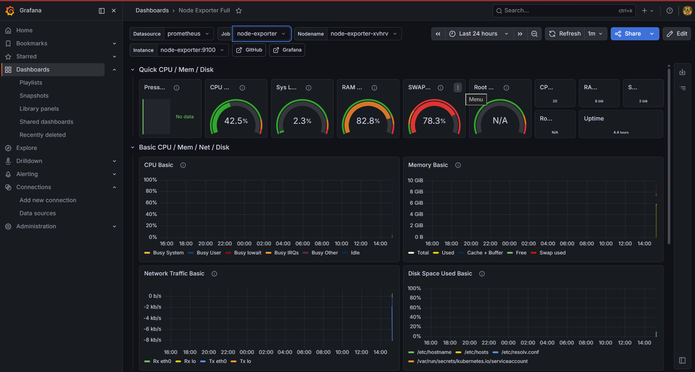

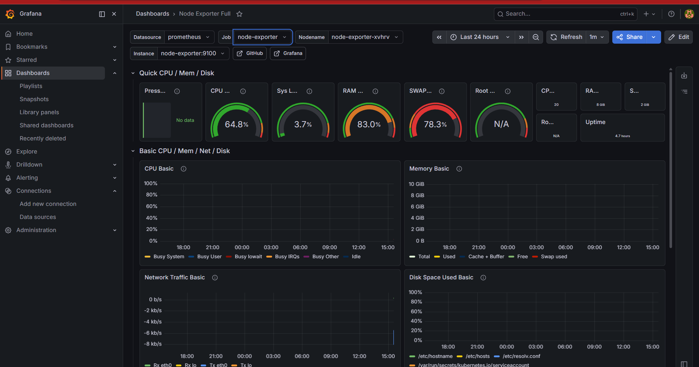

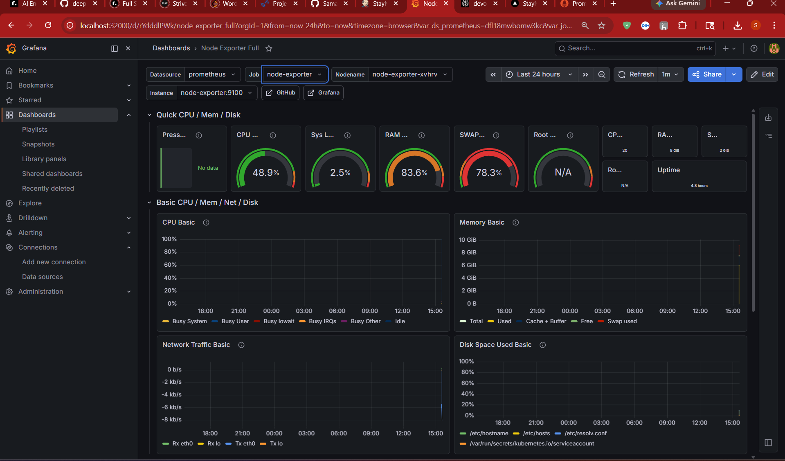

---

## Screenshots Reference

All screenshots are in the `assets/` folder:

| # | File | What It Shows |
|---|---|---|
| 1 | `image.png` | StayNGo app running in browser |
| 2 | `jenkins_pipline.png` | Jenkins multi-stage pipeline view |
| 3 | `jenkins_pipeline#15.txt` | Full Jenkins console log (build #15) |
| 4 | `get_nodes.png` | `kubectl get nodes` — docker-desktop node |
| 5 | `get_all_pods_w.png` | `kubectl get pods -w` — all pods running |
| 6 | `getdeployments.png` | `kubectl get deployments` — scaled replicas |
| 7 | `kubectl_get_all_1.png` | `kubectl get all` — full resources part 1 |
| 8 | `kubectl_get_all_2.png` | `kubectl get all` — full resources part 2 |
| 9 | `actual_deployment.png` | Live deployment view |
| 10 | `targts_(all jobs up).png` | Prometheus targets — all 3 jobs UP |
| 11 | `grafanam_meteric1.png` | Grafana quick stats (CPU, RAM, Swap, Uptime) |
| 12 | `grafana_metric2.png` | Grafana CPU & Memory time-series graphs |
| 13 | `grafana_metric_3.png` | Grafana Network Traffic & Disk Space graphs |

---

## Architecture Diagram

```
┌─────────────────────────────────────────────────────────────┐
│               Docker Desktop — Kubernetes Cluster            │
│                                                              │
│  ┌──────────────┐    ┌──────────────┐                        │
│  │  Frontend    │    │   Backend    │                        │
│  │  x3 replicas │───▶│  x3 replicas │──▶ Supabase (cloud)    │
│  │  Next.js     │    │  Node.js    │                        │
│  └──────────────┘    └──────────────┘                        │
│                                                              │
│  ┌─────────────────────────────────────────────────────┐   │
│  │                 Monitoring Stack                      │   │
│  │                                                       │   │
│  │  node-exporter (DaemonSet) ──►                        │   │
│  │  kube-state-metrics ────────► Prometheus ──► Grafana  │   │
│  │  cAdvisor (K8s API) ────────►           (1860)        │   │
│  └─────────────────────────────────────────────────────┘   │
└─────────────────────────────────────────────────────────────┘
              ▲
   Jenkins (port 8080) + SonarQube (port 9000)
   running on host machine
```

---

*Report generated for StayNGo DevOps Project — May 2026*
